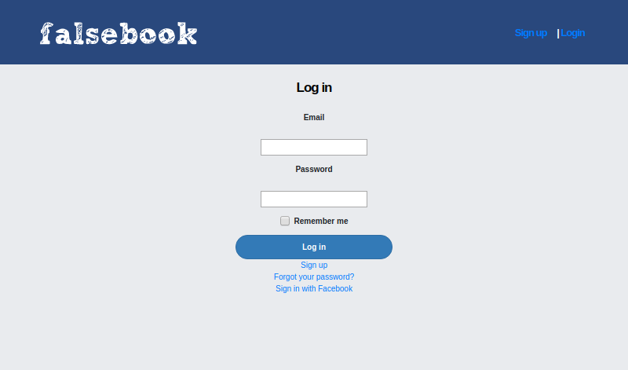

# Facebook clone

## Table of Contents

* [About the Project](#about-the-project)
  * [Built With](#built-with)
* [Contact](#contact)
* [Acknowledgements](#acknowledgements)

<!-- ABOUT THE PROJECT -->
## About The Project

In this project we build a Ruby on Rails app with a similar behaviour than Facebook. Users can:

- Sign up, with real Facebook account and with a normal one.
- Add/remove friends.
- Send or accept friend requests.
- Create posts and comments.
- Like and unlike their own posts/comments and their friend's.

[Live version](https://young-fortress-61632.herokuapp.com)

Link for project specifications: [Odin-Project](https://www.theodinproject.com/courses/ruby-on-rails/lessons/final-project)

### Built With

*   Ruby
*   Ruby on Rails
*   Rubocop
*   Rspec with Capybara for testing
*   Devise for authentication
*   Omniauth for sign in with Facebook Account

<!-- CONTACT -->
## Contact

Melissa Castorena - mcastorena0316@gmail.com

Guadalupe Rangel- kanemekanik@gmail.com

Project Link: [Facebook Clone](https://github.com/Luzaks/facebook-clone/tree/master)

<!-- ACKNOWLEDGEMENTS -->
## Acknowledgements

* [Microverse](https://www.microverse.org/)